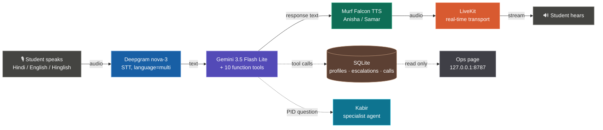

# ऋषिका (Rishika) — a Hindi-first voice teaching assistant for line follower robots

A voice agent that helps school and college students debug the robot sitting on the table in
front of them, in the language they actually think in. Built on the
[Murf LiveKit starter](https://github.com/murf-ai/murf-livekit-starter) for
**10 Days of Voice Agents — VoiceForBharat Edition** (Learning & Literacy track).

[](https://opensource.org/licenses/MIT) [](https://murf.ai/api/docs/text-to-speech/streaming) [](https://docs.livekit.io) [](https://www.python.org/)

---

## The problem

A line follower robot (LFR) is the first real robot most Indian students build — two IR
sensors, an L298N motor driver, and a PID loop that refuses to behave. It is also the first
place they get properly stuck: it's 11pm, the robot is zig-zagging across the line, the
workshop mentor went home, and the only help available is an English YouTube video about
somebody else's chassis.

Voice is the right interface here for two reasons. Their hands are on the hardware — holding
a multimeter, turning a trimpot — so typing is not an option. And the question in their head
is *"मेरा robot line पर ज़िग-ज़ैग कर रहा है"*, not its English translation. Rishika takes the
question in that form and answers in it.

---

## What she does

| Capability | How it works |
| :--- | :--- |
| **Speaks Indian English + Hindi** | Murf Falcon `Anisha` voice; Deepgram `nova-3` with `language="multi"` so code-mixed Hinglish transcribes without a language switch |
| **Remembers returning students** | SQLite profile — level, topics covered, mistakes noted. Written **only** after spoken consent, and deletable on request |
| **Teaches with live data** | Free Dictionary API for terms, Open Trivia DB for quiz questions, and a scoring tool that rates a spoken answer 0–100 with one line of feedback |
| **Shows its work on screen** | Quiz questions arrive as clickable cards over the LiveKit data channel; clicking one answers out loud |
| **Calls students for practice** | Outbound SIP call that opens by saying who is calling, why, and how to stop it |
| **Knows when to fetch a human** | Hardware danger (burning smell, hot driver) or real distress creates a mentor request with a reference ID — after asking permission |
| **Records how calls went** | Every session ends with an outcome row; a local ops page shows totals and success rate |
| **Hands off to a specialist** | PID tuning goes to **Kabir**, a second agent with a different voice, who inherits the whole conversation |

---

## How the system works



Four components do the work: **STT** turns speech into text, an **LLM** decides what to say
and which tool to call, **TTS** turns the reply back into speech, and **real-time transport**
moves audio both ways with low enough latency that it feels like a conversation. Swap any one
of them without touching the others.

### Why Murf Falcon for the TTS leg

- **55 ms** model latency, **130 ms** time-to-first-audio
- **$0.01 / 1000 characters**
- 150+ voices across 35+ languages, including the Indian English voices this project needs
- [Benchmarks](https://murf.ai/falcon/benchmarks)

In a voice loop, TTS latency is the part the user feels most — it sits between "the agent has
decided what to say" and "the student hears it".

---

## Quickstart

### Prerequisites

- **Python 3.10+** and **[uv](https://docs.astral.sh/uv/)**
  ```bash
  # macOS/Linux
  curl -LsSf https://astral.sh/uv/install.sh | sh
  # Windows (PowerShell)
  powershell -ExecutionPolicy ByPass -c "irm https://astral.sh/uv/install.ps1 | iex"
  ```
- **Node.js 18+** and **pnpm** (`npm install -g pnpm`)
- Free accounts: [LiveKit Cloud](https://cloud.livekit.io/),
  [Murf](https://murf.ai/api/dashboard), [Deepgram](https://deepgram.com),
  [Google AI Studio](https://aistudio.google.com/apikey)

### 1. Clone

```bash
git clone https://github.com/Mayank-CS50/murf-livekit-starter.git
cd murf-livekit-starter
```

### 2. Add your API keys — without committing them

Every key lives in a **`.env.local`** file, and `.env.*` is gitignored in both
`backend/.gitignore` and `frontend/.gitignore`. The tracked `.env.example` files are
templates with placeholder values; never put a real key in one.

```bash
cp backend/.env.example  backend/.env.local
cp frontend/.env.example frontend/.env.local
```

Fill in `backend/.env.local`:

| Variable | Where to get it |
| :--- | :--- |
| `LIVEKIT_URL` / `LIVEKIT_API_KEY` / `LIVEKIT_API_SECRET` | LiveKit Cloud → project → Settings |
| `MURF_API_KEY` | [murf.ai/api/dashboard](https://murf.ai/api/dashboard) |
| `DEEPGRAM_API_KEY` | [deepgram.com](https://deepgram.com) |
| `GOOGLE_API_KEY` | [aistudio.google.com/apikey](https://aistudio.google.com/apikey) |

The same three `LIVEKIT_*` values go in `frontend/.env.local` — the frontend and backend never
talk to each other directly, they meet inside the same LiveKit project. Everything else in
`.env.example` (SIP trunk for outbound calls, escalation webhook) is optional; skip it and the
browser session works fine.

Before your first commit, confirm nothing secret is staged:

```bash
git status --short          # no .env.local, no *.db
```

### 3. Install

```bash
cd backend  && uv sync && uv run python src/agent.py download-files
cd ../frontend && pnpm install
```

`download-files` fetches the Silero VAD and turn-detector model weights once.

### 4. Run it

Two terminals is the normal way:

```bash
# Terminal 1 — the agent
cd backend && uv run python src/agent.py dev

# Terminal 2 — the web UI
cd frontend && pnpm dev
```

Or from the repo root, `./start_app.sh` (macOS/Linux) / `.\start_app.ps1` (Windows) starts
both plus a local LiveKit server.

### 5. Have a conversation

Open **http://localhost:3000**, click **Start talking**, allow the microphone, and try these
in order — each one exercises a different part of the system:

| Say this | What should happen |
| :--- | :--- |
| "नमस्ते" | Instant greeting, no LLM call (regex interceptor) |
| "मैं रमेश हूँ, मेरी LFR बन गई है" | She learns your name, asks before saving it |
| "मुझे एक quiz दो" | Filler audio, then a clickable question card |
| "IR sensor का threshold कैसे set करूं?" | She answers herself — no handoff |
| "मेरा robot line पर ज़िग-ज़ैग कर रहा है" | Handoff announced, **Kabir** takes over in a male voice and the transcript turns cyan |
| "अब मुझे एक quiz दो" | Kabir hands the conversation back to Rishika |
| "L298N बहुत गरम है, जलने की smell आ रही है" | She stops debugging and asks permission to alert a human mentor |

Prefer the terminal? `uv run python src/agent.py console` runs the whole loop with no browser.

### The ops page

```bash
cd backend && uv run python src/escalations.py     # http://127.0.0.1:8787
```

Call analytics on top (total, successful, failed, success rate, reason breakdown), open mentor
requests below. It binds to `127.0.0.1` and **has no authentication** — keep it local, don't
port-forward it. There is no transcript column anywhere in the schema; a call is stored as
counts and an outcome, never as what was said.

```bash
uv run python src/analytics.py                     # same numbers in the terminal
uv run python src/escalations.py --list            # mentor queue
uv run python src/escalations.py --resolve ESC-4F2A
```

### Tests

```bash
cd backend && uv run python -m pytest tests -q     # 35 tests, no network, no API keys needed
```

They cover the parts where a prompt alone can't be trusted: consent enforcement, PID routing
(ten real learner sentences, five that must stay with Rishika and five that must not), opt-out
persistence, outcome classification, and a check that nothing private can reach the dashboard.

---

## Project structure

```
murf-livekit-starter/
├── backend/
│   ├── src/
│   │   ├── agent.py              # entrypoint, session, SYSTEM_PROMPT, 10 tools
│   │   ├── db_memory.py          # SQLite profiles + opt-outs
│   │   ├── educational_tools.py  # dictionary, quiz, answer scoring
│   │   ├── static_intents.py     # regex greeting interceptor, tool fillers, call opening
│   │   ├── escalations.py        # mentor requests + the ops page (stdlib http.server)
│   │   ├── analytics.py          # call outcomes, stats, dashboard markup
│   │   ├── specialists.py        # Kabir, the PID tuning agent + routing guard
│   │   ├── dispatch_outbound.py  # place an outbound practice call
│   │   └── setup_sip_trunk.py    # one-time SIP trunk registration
│   ├── tests/                    # 35 offline tests
│   └── data/                     # SQLite lives here — gitignored
├── frontend/
│   ├── components/agents-ui/     # transcript, tool cards, control bar, visualizers
│   └── app/                      # Next.js pages + LiveKit token endpoint
└── handoff.md                    # day-by-day build log, including what was deliberately skipped
```

## Configuration

| Change | Where |
| :--- | :--- |
| Personality, guardrails, language rules | `SYSTEM_PROMPT` in `backend/src/agent.py` |
| Voice | `tts=murf.TTS(voice=...)` in `agent.py` — `Anisha`, `Pooja` (female IN), `Samar` (male IN), and [150+ more](https://murf.ai/api/docs/voices-styles/voice-library) |
| STT | `deepgram.STT(model="nova-3", language="multi")` — drop `language="multi"` if you only need English |
| LLM | `google.LLM(model="gemini-3.5-flash-lite")`, or swap in the OpenAI plugin |
| Specialist's voice and scope | `PID_COACH_PROMPT` and the `tts=` override in `specialists.py` |

## Known limitations

- **Outbound calling is untested against a real phone number** — the SIP dial path, opening
  disclosure and opt-out all work, but a paid trunk was never attached. Free softphone route
  is documented in `backend/.env.example`.
- **The ops page has no auth.** Local-only by design.
- Earlier commits in this repo's history contain a development SQLite file with test learner
  profiles. It is no longer tracked, but the history was not rewritten.
- Answering-machine detection, retry scheduling, and a second specialist were all skipped on
  purpose. `handoff.md` records why for each.

## Links

- [Murf API docs](https://murf.ai/api/docs) · [voice library](https://murf.ai/api/docs/voices-styles/voice-library) · [Falcon 2](https://murf.ai/api/docs/text-to-speech-models/falcon-2)
- [LiveKit Agents docs](https://docs.livekit.io/agents/) · [Deepgram docs](https://developers.deepgram.com)
- Upstream template: [murf-ai/murf-livekit-starter](https://github.com/murf-ai/murf-livekit-starter)

## License

MIT


