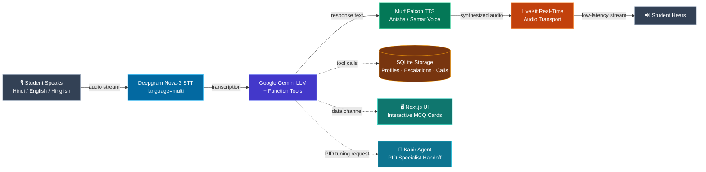

# Rishika (ऋषिका) — Voice AI Teaching Assistant for Line Follower Robots


**Rishika** is a real-time, bilingual (Hindi + English) conversational Voice AI Assistant designed to help robotics students, engineers, and hobbyists build and debug **Line Follower Robots (LFR)**.

When hands are occupied holding multimeters, soldering irons, or adjusting trimpots, Rishika provides instant hands-free guidance in Hinglish, diagnoses hardware faults, scores quiz knowledge, and hands off complex PID loop tuning to specialized AI agents.

---

## 💡 The Problem & Solution

### The Challenge
A Line Follower Robot (LFR) is often the first autonomous hardware project built by engineering students — combining dual IR sensors, an L298N motor driver, and a PID feedback loop. When a robot starts zig-zagging or burning out motor drivers at 11 PM in a robotics lab, typing questions into text search is impractical, and English-only documentation fails to capture how students naturally explain issues: *"मेरा robot line पर zig-zag कर रहा है"*.

### The Solution
Rishika bridges this gap by listening in natural, code-mixed Hinglish and replying with human-like, ultra-low latency speech (powered by Murf Falcon TTS). She interacts hands-free, pushes interactive quiz cards over LiveKit data channels, tracks student learning progress in SQLite, escalates dangerous hardware faults to human mentors, and delegates PID tuning to **Kabir** — a specialized AI PID Coach.

---

## ⚙️ Architecture & Pipeline Flow



---

## ✨ Key System Features

| Feature | Description | Technical Implementation |
| :--- | :--- | :--- |
| **Bilingual Hinglish Voice** | Code-mixed Hindi/English speech recognition and natural Indian English synthesis | Deepgram `nova-3` (`language="multi"`) + Murf Falcon `Anisha` voice |
| **Persistent Learner Profiles** | Remembers student progress, robotics topics, and past mistakes across calls | SQLite database with explicit user privacy consent gates (`db_memory.py`) |
| **Interactive Screen Cards** | Pushes interactive quiz and diagnostic cards onto the web interface | LiveKit data channel broadcasting (`educational_tools.py` + Shadcn UI components) |
| **Specialist Agent Handoff** | Context-preserving handoff to **Kabir**, a dedicated PID tuning specialist | LiveKit Agent switching with conversational context transfer (`specialists.py`) |
| **Human Mentor Escalation** | Flags hardware hazards (burning components, electrical shorts) or student distress | SQLite ticket creation (`ESC-XXXX`) with Discord/Slack webhooks (`escalations.py`) |
| **Operations & Analytics** | Operations dashboard tracking call outcomes, success rates, and engagement | Local HTTP Ops dashboard running on `127.0.0.1:8787` (`analytics.py`) |
| **Telephony / Outbound Calls** | Supports outbound SIP dialing for daily practice calls | LiveKit Telephony / SIP trunking dispatch (`dispatch_outbound.py`) |

---

## 📁 Repository Structure

```
.
├── backend/                  # Python Voice Agent Service (LiveKit + Murf Falcon)
│   ├── src/
│   │   ├── agent.py          # Main entrypoint & voice pipeline configuration
│   │   ├── analytics.py      # Operations dashboard & call classification
│   │   ├── db_memory.py      # SQLite persistent memory & consent layer
│   │   ├── educational_tools.py # Dictionary, Open Trivia DB & quiz scorers
│   │   ├── escalations.py    # Mentor escalation tickets & webhooks
│   │   ├── specialists.py    # Kabir PID Coach specialist agent
│   │   └── static_intents.py # Instant regex intents & spoken fillers
│   ├── tests/                # Automated pytest suite & LLM evals
│   ├── pyproject.toml        # Python dependencies (managed via uv)
│   └── Dockerfile            # Container deployment specification
│
├── frontend/                 # Next.js 15 Web Application (React + TypeScript)
│   ├── app/                  # Next.js pages & API token endpoints
│   ├── components/           # UI components (3D Spline, LiveKit visualizers, tool cards)
│   ├── app-config.ts         # Visualizer & theme configuration
│   └── package.json          # Node dependencies (managed via pnpm)
│
├── start_app.ps1             # PowerShell script to launch Backend & Frontend (Windows)
├── start_app.sh              # Shell script to launch Backend & Frontend (Linux/macOS)
└── AGENTS.md                 # Agent architecture & developer guidelines
```

---

## 🚀 Quickstart & Setup Guide

### Prerequisites
- **Python 3.10+** with **[uv](https://astral.sh/uv/)** installed
- **Node.js 18+** with **pnpm** (`npm install -g pnpm`)
- API credentials for:
  - [LiveKit Cloud](https://cloud.livekit.io/)
  - [Murf AI](https://murf.ai/)
  - [Deepgram](https://deepgram.com/)
  - [Google AI Studio](https://aistudio.google.com/)

### 1. Clone Repository
```bash
git clone https://github.com/Mayank-CS50/Rishika-AI_Robotics_Guide.git
cd Rishika-AI_Robotics_Guide
```

### 2. Backend Setup
```bash
cd backend

# Install Python dependencies
uv sync

# Pre-download VAD models
uv run python src/agent.py download-files

# Copy environment template & add your keys
cp .env.example .env.local
```

Configure `.env.local`:
```env
LIVEKIT_URL=wss://your-project.livekit.cloud
LIVEKIT_API_KEY=your_livekit_key
LIVEKIT_API_SECRET=your_livekit_secret
MURF_API_KEY=your_murf_key
DEEPGRAM_API_KEY=your_deepgram_key
GOOGLE_API_KEY=your_google_gemini_key
```

Run the backend agent:
```bash
# Run in development mode (with auto-reload)
uv run python src/agent.py dev
```

---

### 2. Frontend Setup

```bash
cd frontend

# Install Node dependencies
pnpm install

# Copy environment template
cp .env.example .env.local
```

Configure `frontend/.env.local`:
```env
LIVEKIT_URL=wss://your-project.livekit.cloud
LIVEKIT_API_KEY=your_livekit_key
LIVEKIT_API_SECRET=your_livekit_secret
```

Run the development web application:
```bash
pnpm dev
```

Open [http://localhost:3000](http://localhost:3000) in your browser to interact with Rishika.

---

## 🧪 Testing & Verification

Run the automated test suite for the voice backend:

```bash
cd backend

# Run all pytest suites
uv run pytest

# Check code formatting & linting
uv run ruff check .
```

---

## 📄 License

Distributed under the [MIT License](LICENSE).
