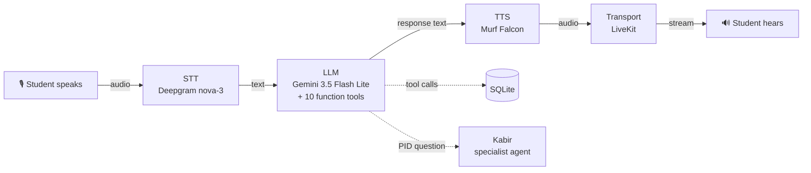

It's 11pm. A student has a line follower robot on the table, two IR sensors, an L298N motor
driver, and a robot that zig-zags across the black line like it's avoiding it on purpose. The
workshop mentor went home at six. The only help on the internet is a YouTube video, in English,
about somebody else's chassis.

I spent ten days building the thing I wanted at that hour: **ऋषिका (Rishika)**, a voice agent
that takes the question in the form it actually arrives in — *"मेरा robot line पर ज़िग-ज़ैग कर रहा
है"* — and answers in the same breath of Hindi and English.

This post is both the story and the guide. Code is at the bottom, and every claim in here has a
file you can go read.

---

## Why voice, specifically

I want to be honest about this, because "let's add voice" is often a solution looking for a
problem. Two things made it the right interface here:

**Their hands are busy.** A student debugging a robot is holding a multimeter in one hand and
turning a trimpot with the other. Typing means putting the robot down, which means losing the
state they were testing.

**The question isn't in English.** It's in Hinglish, and the code-switch lands mid-sentence:
*"Kp बढ़ाया तो oscillation और बढ़ गया"*. A chat box invites the student to translate first, and
the translation is where the actual symptom gets lost. Speech doesn't ask them to do that.

The track I picked was **Learning & Literacy**, and the user is specific: a school or first-year
engineering student building their first robot, more comfortable in Hindi than English, with
nobody to ask after class.

---

## What she does

Rishika is a generalist tutor for one narrow domain. She:

- **Speaks Indian English and Hindi** — Murf Falcon's `Anisha` voice, with Deepgram `nova-3`
  running `language="multi"` so a Hinglish sentence transcribes without a language switch.
- **Remembers returning students** — level, topics covered, mistakes they've made before. Only
  after they say yes out loud, and deleted the moment they ask.
- **Teaches with live data** — Free Dictionary API for terms, Open Trivia DB for quiz questions,
  and a scoring tool that rates a spoken answer 0–100 with one line of feedback.
- **Shows her work on screen** — quiz questions arrive as clickable cards pushed over the LiveKit
  data channel; clicking an option answers her out loud.
- **Calls students for practice** — an outbound call that opens by saying who's calling, why,
  and how to stop it, before anything else.
- **Fetches a human when she should** — a burning smell from the motor driver isn't a debugging
  problem, it's a safety one. That becomes a mentor request with a reference ID, after asking
  permission.
- **Records how every call went** — one outcome row per session, on a local ops page.
- **Hands off PID tuning to a specialist** — Kabir, a second agent with his own voice, who
  inherits the entire conversation.

---

## How the system works

Every voice agent, regardless of framework, is the same four boxes:



1. **STT** — speech to text. Deepgram `nova-3` with `language="multi"`.
2. **LLM** — decides what to say and which tool to call. Gemini 3.5 Flash Lite; cheap and fast
   matters more than clever here, because latency is the whole product.
3. **TTS** — text back to speech. **Murf Falcon**.
4. **Real-time transport** — moves audio both ways. LiveKit, which also handles turn detection,
   voice activity detection, and interruptions.

The nice property is that these are independent. Swapping the voice is one argument; swapping
the LLM is one line.

### Where the latency budget goes

The student's felt delay is STT + LLM + TTS, and you don't get to spend much. Falcon's numbers
are the reason I didn't have to think hard about the TTS leg:

- **55 ms** model latency
- **130 ms** time-to-first-audio
- **$0.01 per 1000 characters**

TTS sits in the worst possible place in the chain — after the agent has decided what to say, but
before the student hears anything. Every millisecond there is dead air in a conversation.

One thing I'd flag for anyone starting: the LiveKit Murf plugin takes a tokenizer, and the choice
matters more than it looks.

```python
tts=murf.TTS(
    voice="Anisha",
    style="Casual",
    tokenizer=tokenize.basic.SentenceTokenizer(min_sentence_len=2),
    text_pacing=True,
)
```

`SentenceTokenizer` streams audio sentence by sentence instead of waiting for the full reply, so
the student hears the first sentence while the LLM is still writing the third. Come back to that
`min_sentence_len=2` in a minute — it caused one of my bugs.

---

## Five features worth your time

I'm skipping the day-by-day. These are the five that changed how the thing feels.

### 1. A voice that sounds like it's from here

Falcon's `Anisha` is Indian English, and that does more work than I expected. Students stop
translating themselves. The prompt then has one hard rule: replies are written in **Devanagari**
for Hindi, never romanised — because TTS reads `"mera robot"` with English phonetics and it comes
out wrong. Script discipline in the prompt is pronunciation engineering.

### 2. Memory that asks first

Three tools: `lookup_user`, `save_user_memory`, `forget_user_memory`. A returning student gets
*"पिछली बार हमने IR sensors किए थे"* instead of starting over.

The part I'd defend hardest is that **nothing is written without spoken consent**, and that rule
does not live in the prompt. More on why in the challenges section.

### 3. Tool results on screen, clickable

Voice-only has a real failure mode: a four-option MCQ read aloud is impossible to hold in your
head. So quiz questions get pushed over the LiveKit data channel as a `TOOL_RESULT_CARD` payload
and render as buttons. Click one and it answers Rishika out loud — the click becomes a turn in
the voice conversation rather than a separate UI mode.

### 4. Knowing when to stop being an AI

Two escalation triggers only:

| Trigger | Example |
| :--- | :--- |
| `needs_human_mentor` | Burning smell, motor driver too hot to touch, smoke |
| `learner_distress` | Crying, quitting, self-doubt that survives one round of encouragement |

Difficulty is explicitly *not* a trigger — a hard PID question is her job. But a burning smell
isn't a debugging problem, and no amount of voice agent helps. She stops, lists exactly what
she'll send, asks permission, and returns a reference ID with an honest timeline: "within one
working day", never "right now".

### 5. A specialist with a different voice

PID tuning is where LFR builds actually die, and it needs a different mode of attention — three
numbers, one at a time, over several turns. So it got its own agent: **Kabir**, who tunes Kp, Ki
and Kd and does nothing else. Rishika has 10 tools; Kabir has exactly one, the exit.

Three things make the handoff not feel like a phone tree:

```python
super().__init__(
    instructions=PID_COACH_PROMPT + _briefing(main, learner_request),
    chat_ctx=main.chat_ctx,        # he inherits the whole conversation
    tts=murf.TTS(voice="Samar", style="Conversation", ...),   # and a male voice
)
```

He **inherits `chat_ctx`**, so he already knows the student's name and what the robot is doing —
nobody explains their problem twice. He **sounds different**, because a handoff you can only read
isn't a handoff. And the `tts=` override lives on the agent rather than the session, so handing
back restores Rishika's voice automatically with no bookkeeping.

---

## Three things that went wrong

### 1. Prompts cannot hold a guardrail

This is the lesson I'd keep if I forgot everything else.

I had written, in clear capital letters, that the escalation tool must only be called after the
student agrees out loud. It worked most of the time. "Most of the time" is not what you want from
the code path that decides whether a child's name and problem get posted to a mentor channel.

Same story with the handoff. The tool's docstring says PID symptoms only, and lists what stays
with Rishika. The LLM cheerfully sent an IR-sensor threshold question to the PID coach anyway,
because "sensor" and "tuning" live near each other in embedding space.

The fix was to stop asking and start checking. The guard moved **inside the tool**, where the LLM
can't negotiate with it:

```python
@function_tool
async def transfer_to_pid_specialist(self, context, learner_request: str) -> Agent | str:
    if not specialists.needs_pid_coach(learner_request):
        return (
            "NOT_TRANSFERRED: that request has no PID or tuning symptom in it, so it is "
            "yours to answer. Handle it yourself now, and only transfer if they describe "
            "zig-zagging, wobbling, oscillation, overshoot, or ask about Kp, Ki or Kd."
        )
    ...
```

`needs_pid_coach()` is a narrow regex — `PID`, `Kp/Ki/Kd`, oscillation, wobble, zig-zag, overshoot,
in English and Devanagari. Bare "tune" doesn't match. When it refuses, it returns a *string* rather
than an agent, so LiveKit doesn't switch and the LLM gets told to answer the question itself.

The consent path is gated twice, in the tool and again in `escalations.create_or_update()`, so an
LLM that forgets to ask cannot create a row even if it passes `consent_confirmed=True` by accident
in one layer.

**The prompt asks nicely. The code decides.** If a rule matters, write it where the model can't
reach it — and then write a test, because a regression here is invisible in a demo.

### 2. Murf said "pid"

Small bug, disproportionately embarrassing. Every time the agent said `PID`, the TTS pronounced it
as a word — "pid" — which instantly destroys the illusion that you're talking to someone who has
built a robot.

First fix: write it as `P.I.D.`. This was worse. Remember `SentenceTokenizer(min_sentence_len=2)`?
It splits on periods. So `P.I.D.` became three sentence fragments, each streamed as its own audio
chunk, and the speech went choppy exactly where I'd tried to make it clearer.

What actually works is spelling it out with spaces — `पी आई डी` in Hindi, `P I D` in English —
enforced in all three places text reaches the TTS: the fixed handoff announcement, Rishika's
system prompt, and Kabir's prompt. Then a test, because this is precisely the kind of rule an LLM
quietly reverts:

```python
def test_pid_is_never_spoken_as_one_word():
    assert "PID" not in static_intents.HANDOFF_TO_PID_FILLER
    assert "पी आई डी" in static_intents.HANDOFF_TO_PID_FILLER
    assert "पी आई डी" in specialists.PID_COACH_PROMPT
```

Generalisable lesson: acronyms, phone numbers, IDs and units all need spelling rules in the prompt,
and the tokenizer's behaviour decides which spelling works.

### 3. A UI signal that vanished a second after it arrived

The most interesting one, and it took the longest.

Both Rishika and Kabir share **one room participant**. Nothing in the audio stream or the
transcript stream says which of them is talking. So the backend publishes a participant attribute
on handoff:

```python
await get_job_context().room.local_participant.set_attributes({"active_agent": "kabir"})
```

The frontend reads it, turns the transcript cyan and relabels the speaker. Clean. It also didn't
work — the transcript stayed pink and labelled `RISHIKA` forever, while the backend logs happily
showed the attribute being set.

I'd been reading it through the React hook:

```tsx
const { attributes } = useAgent();
const activeAgent = attributes?.active_agent;   // undefined, always
```

Reading the compiled hook source explained it. The `AttributesChanged` listener replaces the whole
state with only the **changed** keys:

```js
const S = (_) => { w(_); };   // w = setState, _ = changedAttributes
```

And the LiveKit agents framework writes `lk.agent.state` on *every* listening → thinking →
speaking transition. So within about a second of Kabir setting `active_agent`, the hook's state
collapsed to `{'lk.agent.state': 'speaking'}` and my key was gone.

The fix reads the participant's own full attribute map instead of the hook's delta cache:

```tsx
const { state: agentState, internal } = useAgent();
const activeAgent = internal.agentParticipant?.attributes.active_agent;
```

Two takeaways. When a value that should be sticky isn't, check whether something between you and
the source is *replacing* state where it should be *merging* it. And when the docs don't explain a
hook's behaviour, `node_modules` will — reading the compiled source took twenty minutes and three
wrong theories cost me an hour before that.

---

## Build your own

The fastest starting point is the [Murf LiveKit starter](https://github.com/murf-ai/murf-livekit-starter) —
it gets you a working voice loop, and then you change the prompt. My repo is that starter plus nine
days of additions.

You need Python 3.10+, [uv](https://docs.astral.sh/uv/), Node 18+, pnpm, and free accounts at
LiveKit Cloud, Murf, Deepgram and Google AI Studio.

```bash
git clone https://github.com/Mayank-CS50/murf-livekit-starter.git
cd murf-livekit-starter
```

### Where the API keys go

This is worth doing properly on day one, not day nine. Keys go in **`.env.local`**, which is
gitignored in both `backend/` and `frontend/`. The tracked `.env.example` files are templates with
placeholders — never put a real key in one, because that's the file that gets committed.

```bash
cp backend/.env.example  backend/.env.local
cp frontend/.env.example frontend/.env.local
```

Fill in `LIVEKIT_URL`, `LIVEKIT_API_KEY`, `LIVEKIT_API_SECRET`, `MURF_API_KEY`,
`DEEPGRAM_API_KEY`, `GOOGLE_API_KEY`. The three `LIVEKIT_*` values go in the frontend too — the
frontend and backend never call each other, they meet inside the same LiveKit project.

Then check before every commit:

```bash
git status --short      # no .env.local, no *.db
```

Learn from me on that second one: I had a SQLite file with test student profiles tracked in git for
a week without noticing. `.gitignore` covered `.env.*` and nothing else. If your agent stores
anything about a user, add the database to `.gitignore` before your first commit, not after.

### Install and run

```bash
cd backend  && uv sync && uv run python src/agent.py download-files
cd ../frontend && pnpm install
```

Two terminals:

```bash
cd backend  && uv run python src/agent.py dev     # the agent
cd frontend && pnpm dev                            # the UI
```

Open **http://localhost:3000**, click **Start talking**, allow the mic. Or skip the browser
entirely with `uv run python src/agent.py console`, which runs the whole loop in the terminal — the
fastest way to iterate on a prompt.

### Test that it actually works

Say these in order; each exercises a different layer:

| Say | Expect |
| :--- | :--- |
| "नमस्ते" | Instant greeting, zero LLM tokens (regex interceptor) |
| "मैं रमेश हूँ" | She learns your name and asks before saving |
| "मुझे एक quiz दो" | Filler audio, then a clickable question card |
| "IR sensor का threshold कैसे set करूं?" | She answers herself — no handoff |
| "मेरा robot line पर ज़िग-ज़ैग कर रहा है" | Handoff announced, Kabir takes over in a male voice, transcript turns cyan |
| "L298N गरम है, जलने की smell आ रही है" | She stops debugging and asks to alert a human |

If the agent never responds, it's almost always one of three things: the backend isn't running,
the frontend and backend are pointed at different LiveKit projects, or the mic permission was
denied. Check the backend terminal first — it logs the room join.

### 35 tests, no network

```bash
cd backend && uv run python -m pytest tests -q
```

They run with no API keys and no LiveKit session, and they cover exactly the places a prompt can't
be trusted: consent enforcement, PID routing (ten real student sentences — five that must stay with
Rishika, five that must not), opt-out persistence, outcome classification, and an assertion that
nothing private can reach the dashboard.

---

## Privacy, briefly

Worth stating because a tutor for students collects exactly the data you'd least want leaked. The
call analytics table has **no transcript column, no message log, and no phone number field** — a
call is stored as turn counts, an outcome, and a duration. Student names are stripped to letters
before they reach the dashboard, so a hallucinated name carrying digits can't leak. Escalation
summaries run through a PII scrub that strips phone numbers, OTPs, PINs and account numbers while
leaving `L298N` and `PID` intact. And the ops page has no authentication, so it binds to
`127.0.0.1` and stays there.

---

## What I'd improve next

- **A real phone call.** The outbound SIP path, opening disclosure and opt-out all work in code and
  in tests, but I never attached a paid trunk, so it has never rung an actual phone.
- **Latency-to-first-speech on the dashboard.** I'm quoting Falcon's published numbers in this
  post rather than my own measurements, which is exactly the sort of thing that should be a chart
  from my own `metrics_collected` stream.
- **An IR-calibration specialist**, the obvious second agent. Skipped deliberately — one working
  handoff satisfied the requirement and a second doubles the routing surface.
- **Real students.** Everything above is validated by me and a test suite. That's not the same as
  a fifteen-year-old at 11pm, who will do things to this agent I haven't imagined.

---

## Links

- **Code:** [github.com/Mayank-CS50/murf-livekit-starter](https://github.com/Mayank-CS50/murf-livekit-starter)
  — `handoff.md` in the repo is the build log, including what I skipped and why
- **Starter template:** [murf-ai/murf-livekit-starter](https://github.com/murf-ai/murf-livekit-starter)
- **Murf Falcon:** [docs](https://murf.ai/api/docs/text-to-speech-models/falcon-2) ·
  [benchmarks](https://murf.ai/falcon/benchmarks) ·
  [voice library](https://murf.ai/api/docs/voices-styles/voice-library)
- **LiveKit Agents:** [voice AI quickstart](https://docs.livekit.io/agents/start/voice-ai/)

---

If you're picking this up: build the boring loop first — mic in, voice out, one prompt. Everything
interesting I built came from listening to that loop being wrong, and none of it was on my plan on
day one.

Built for **10 Days of Voice Agents — VoiceForBharat Edition**.


